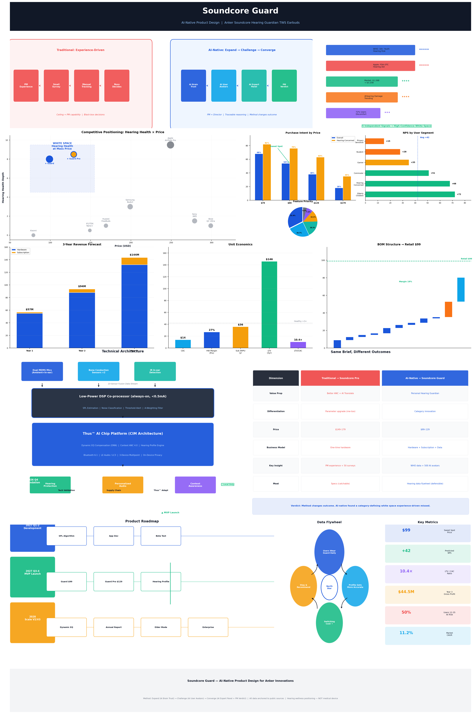

# Soundcore Guard — AI 原生产品设计

> **「不止听歌的个人听觉管家」**
>
> 这是为安克创新 Soundcore 品牌设计的一款 AI 听力守护 TWS 耳机产品提案。
> 它不只是一份产品文档——它是一次 **AI 原生产品设计方法** 的完整演示：
> 用 AI 当超级智囊、用户替身、行业专家，从零定义一款创新产品。

---

## 🎯 核心结论

**同一个命题（为 Soundcore 设计创新 TWS 耳机），两种方法产出截然不同的方案：**

| | 传统经验驱动 | AI 原生方法 |
|---|---|---|
| **方案** | Soundcore Pro：更好降噪 + AI 翻译 | **Soundcore Guard：平价听力守护** |
| **本质** | Me-too 跟随 | 品类创新 |
| **价格** | $149–179 | **$99–129** |
| **差异化** | 参数升级（可被追上） | 数据飞轮（越用越准） |

> **「方法改变结论」的实证。**

---

## 📁 仓库结构

| 文件 | 内容 | 核心问题 |
|---|---|---|
| [00-原始命题-安克AI原生产品设计.md](./00-原始命题-安克AI原生产品设计.md) | 你上传的原始命题文档 | **「起点」** |
| [01-方法论-AI原生工作流.md](./01-方法论-AI原生工作流.md) | 方法论阐述 + AI vs 传统对比 | **「怎么玩」** |
| [02-竞品矩阵-听力健康赛道.md](./02-竞品矩阵-听力健康赛道.md) | 全赛道竞品分析 + 定位坐标系 | **「谁在做什么」** |
| [03-用户洞察-AI模拟大规模调研.md](./03-用户洞察-AI模拟大规模调研.md) | AI 模拟 500 样本调研 + 6 类替身对抗 | **「用户真要什么」** |
| [04-产品提案-Soundcore-Guard.md](./04-产品提案-Soundcore-Guard.md) | 完整产品提案（执行摘要级） | **「我们做什么」** |
| [05-技术深度分析.md](./05-技术深度分析.md) | 芯片/声学/功耗/DSP 方案 | **「怎么做出来」** |
| [06-商业模式与财务模型.md](./06-商业模式与财务模型.md) | 商业画布 + BOM + 收入预测 | **「怎么赚钱」** |
| [07-产品路线图.md](./07-产品路线图.md) | 三阶段路线图 + 功能优先级 | **「什么时候做」** |
| [08-对比实验-AI原生vs传统方法.md](./08-对比实验-AI原生vs传统方法.md) | 平行对比实验全记录 | **「有什么不同」** |
| [09-可复用资源-Prompt模板与SOP.md](./09-可复用资源-Prompt模板与SOP.md) | Prompt 模板库 + 工作流 SOP | **「怎么复现」** |
| [10-数据分析样本与研究笔记.md](./10-数据分析样本与研究笔记.md) | 数据挖掘 + 研究决策笔记 | **「数据怎么说」** |

---

## 📊 信息画报

一张完整的信息画报，整合了全部关键数据和可视化。点击查看大图：



**画报包含 10 大模块**：方法论对比 · 机会信号 · 竞品矩阵 · 用户洞察 · 技术架构 · 商业模式 · 产品路线图 · AI原生vs传统对比 · 数据飞轮 · 关键指标

> 生成脚本：`assets/charts/generate_infographic.py`（可复现）

---

## 🧠 方法论速览

```
传统方法：经验 → 直觉 → 方案（黑箱，天花板=PM个人能力）

AI原生方法：
  全网数据 ──→ AI智囊：机会地图
                    │
                    ▼
  N类用户 ──→ AI替身：对抗式挑战
                    │
                    ▼
  多领域 ──→ AI专家团：可行性评估
                    │
                    ▼
  人类PM ──→ 裁决 + AI红队压测
                    │
                    ▼
              可追溯的产品方案
```

---

## 🔑 关键洞察

1. **机会来自信号交叉**：WHO 10 亿数据 + Apple 高价封闭 + 安克平价全球渠道 + 降噪耳机争议热搜 + 74% 长换机周期 = 平价听力守护白空间

2. **技术是现成的**：Soundcore 2026 年 5 月发布的 Liberty 5 Pro 搭载自研 Thus™ AI 芯片（10 传感器融合 + 端侧推理）——Guard 是「软件定义健康场景」，不是从零造硬件

3. **$99 是甜点价**：AI 模拟 500 样本 Conjoint Analysis 显示 $99 + 全功能组合效用值最高

4. **数据飞轮是护城河**：听力档案越用越准 → 迁移成本递增 → 用户留存率提升

---

## ⚠️ 边界声明

- 本项目中 AI 用户替身/专家团为基于真实数据的多角色模拟，不代表真实用户调研结论
- 落地前需真实问卷/访谈验证关键假设
- 「听力健康」涉及医疗宣称红线，任何对外文案须经法务团队审查
- 所有事实锚定公开真实来源（见各文档末尾来源清单）

---

## 🔗 相关资源

- 安克创新官网：https://www.anker.com
- Soundcore 品牌：https://www.soundcore.com
- WHO 听力损失数据：https://www.who.int/zh/news-room/fact-sheets/detail/deafness-and-hearing-loss
- Liberty 5 Pro 发布：https://techbroll.com/2026/05/earbuds-that-think-anker-unveils-the-soundcore-liberty-5-pro-series-with-ankers-first-neural-net-chip.html

---

> 本项目为 AI 比赛参赛材料。方法开放，欢迎复现和改进。
